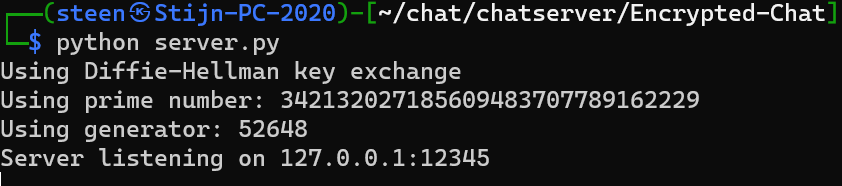
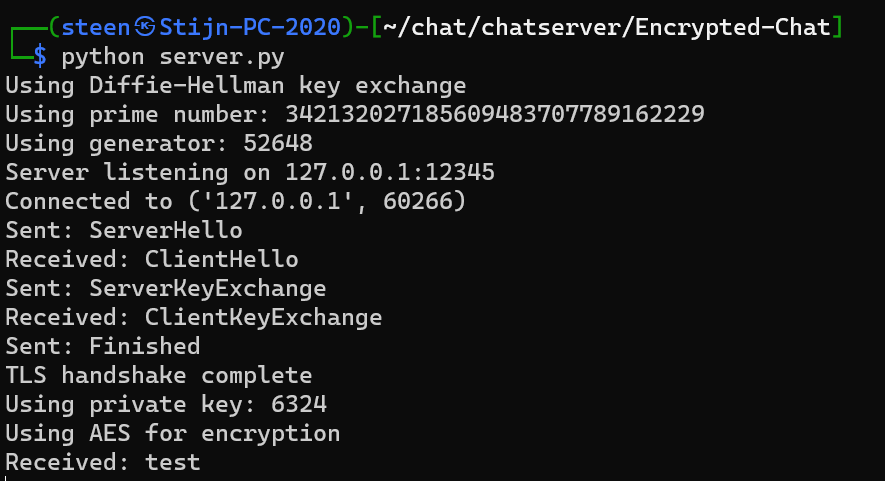
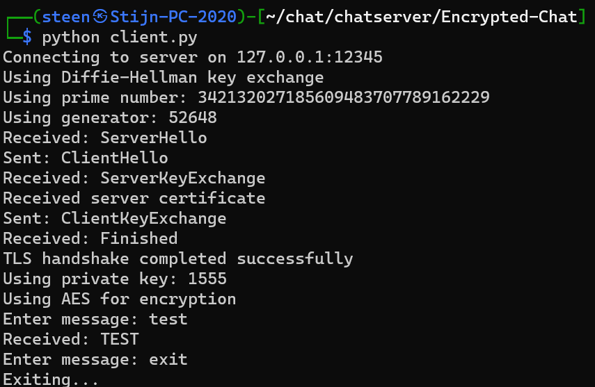

# Encrypted-Chat
Dit programma maakt gebruik van de Diffie Hellman methode om een gezamelijk geheim uit te wisselen. Dit gezamelijk geheim wordt gebruikt om de berichten te versleutelen en te ontsleutelen. Het programma maakt gebruik van een server en een client. Wanneer de client een bericht verstuurt, ontsleuteld de server het bericht, en wordt deze in hoofdletters weer versleuteld. Het versleutelde bericht wordt dan weer naar de client gestuurd. De client ontsleuteld het bericht en print het uit.

## Installatie
Om het programma te installeren, moet je de volgende stappen volgen:
1. Open een terminal
2. Navigeer naar de map waar je het programma wilt installeren
3. Voer de volgende commando's uit:
```bash
pip install Crypto
pip install cryptography
```

## Gebruik Server
Om het programma te gebruiken, moet je de volgende stappen volgen:
1. Open een terminal
2. Navigeer naar de map waar je het programma hebt geinstalleerd
3. Voer de volgende commando's uit:
```bash
python server.py
```
De server zal nu opstarten en wachten op een client.

Wanneer de client verbonden is worden de ontvangen berichten getoond in de terminal.


## Gebruik Client
Om het programma te gebruiken, moet de server al opgestart zijn, anders functioneert de client niet. Als de server opgestart is moet je de volgende stappen volgen:
1. Open een terminal
2. Navigeer naar de map waar je het programma hebt geinstalleerd
3. Voer de volgende commando's uit:
```bash
python client.py
```
De client zal nu opstarten en verbinding maken met de server. Wanneer de client verbonden is, worden de encryptiesleutels uitgewsisseld en kan de client berichten versturen. De client kan het programma aflsuiten door "exit" te versturen.


## Functionaliteiten
- [x] Certficaat om de server te verifiëren
- [x] AES encryptie
- [x] Diffie Hellman sleuteluitwisseling
- [x] Verbinding tussen sockets
- [x] Server-Hello en Client-Hello